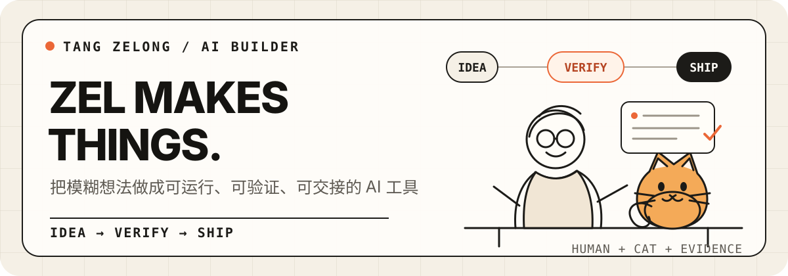

  

  <a href="https://zelong.vip/">个人网站</a> ·
  <a href="https://github.com/tang730125633?tab=repositories">全部项目</a> ·
  <a href="https://github.com/tang730125633/pointer-following-mascot">公开 Skill</a>

我是唐泽龙（Zelong Tang），也可以叫我 Zel。中专汽修专业出身，现在是一名 **AI 智能体编排师与产品协作负责人**。

我不是传统科班程序员。我的优势是把模糊问题讲清楚、拆成可验证的任务，再组织模型、Agent、代码与真人协作，把想法做成普通人真正能用的产品。

我的交付标准是 **IDEA → VERIFY → SHIP**：代码能跑、测试通过、已经部署和用户真正可用，是四个需要分别确认的状态。

## 代表项目

- **[黄雀 AI 微信小程序](https://github.com/tang730125633/huangque-miniprogram)** — 把 IP 定位、AI 作图、配音、视频生成与作品管理串进微信创作流程。
- **[能源行业早报](https://github.com/tang730125633/tang-energy-feed)** — 聚合能源新闻与长江铜价，产出带来源状态的 JSON feed，并可由 GitHub Actions 投递飞书。
- **[飞书客户专属群工具](https://github.com/tang730125633/feishu-agent-groups)** — 批量建立「客户 + 能力 Bot + 运营者」专属群，默认 DRY-RUN，并支持试点、断点续跑、防重与限频停机。
- **[AlwaysHaveAPlan](https://github.com/tang730125633/alwayshaveaplan)** — 一款 macOS 原生专注工具：解锁时回看当前日程，专注结束后可把记录写入个人 Obsidian 日记。

## 公开 Skills

- **[pointer-following-mascot](https://github.com/tang730125633/pointer-following-mascot)** — 为网站加入鼠标跟随萌宠；提供零依赖分层 DOM 与可复现的 240 帧方向精灵图两种方案。

## 我擅长的事情

- **AI 产品落地**：从模糊需求、产品流程到可使用的 Web、微信与自动化工具
- **Agent 与模型系统**：多 Agent 协作、模型路由、长期记忆和任务证据闭环
- **业务自动化**：飞书、定时任务、数据采集、内容生产和客户交付流程
- **可靠交付**：小步可回滚，用测试、日志、运行状态和真实探针验收

## 常用技术

`Python` · `TypeScript` · `JavaScript` · `Shell` · `Swift` · `Go` · `GitHub Actions` · `OpenClaw` · `飞书开放平台`

## 关于我

我从汽修专业毕业后靠自学走进 AI。比起包装学历和头衔，我更愿意公开展示：问题是怎么被拆解的、系统是怎么落地的，以及哪些部分还没有完成验证。

我的长期方向，是用一台 MacBook、AI 和一套可靠的协作方法，在任何地方持续创造真实价值。

<strong>From an idea to a verified, working system.</strong>

